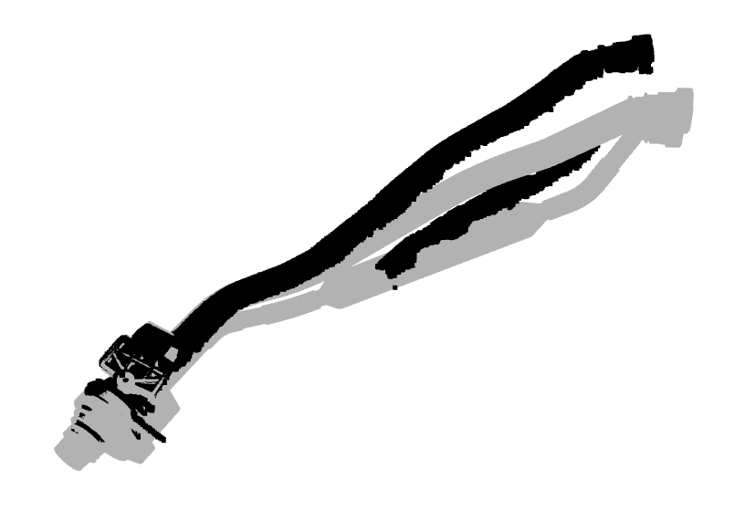
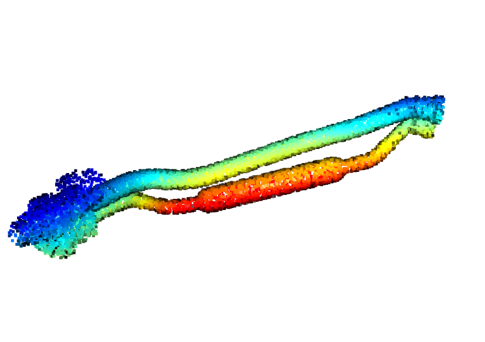
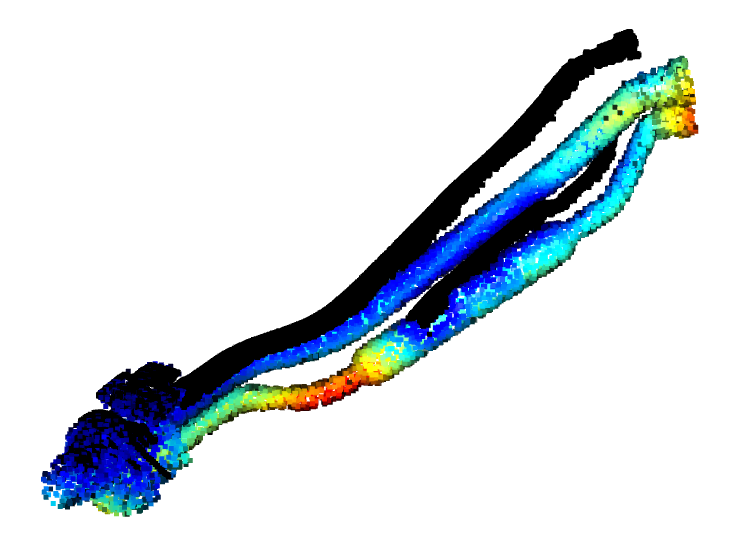
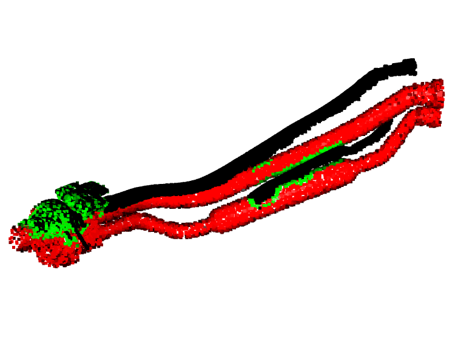

# CAD - Pointcloud surface distance

This repo is to show how to get the distance beetween a cad file and a pointcloud using open3D.

This code performs the following steps to process and visualize point cloud data:

*   Loads a point cloud and a mesh from external sources. Visualizes both sources.



*   Converts the mesh to a point cloud for easier comparison with the original point cloud data.
*   Applies voxel sampling to further downsample the point cloud, which helps in reducing noise and computational load.
*   Visualizes the downsampled point cloud to reduce the number of points and simplify the representation.



*   Calculates the distances between points in the point clouds, which can be used to analyze similarities and differences.
*   Generates a heatmap to represent these distances visually, making it easier to identify patterns or outliers.



*   Assigns random colors to each point in the point cloud to improve visibility and distinguish individual points.
*   Modifies the color of each point based on its distance, specifically:
    
    a. Creates a boolean mask for points with a distance less than 10 mm (indicating close proximity).
    
    b. Sets the color of these points to green, highlighting areas where the point clouds are similar.

*   Visualizes the final point cloud, displaying the color-coded distances and enabling a clear understanding of the spatial relationships between the point clouds.



## Requirements
The following packages are required to run this code:

- `open3d`
- `numpy`
- `matplotlib`

## Usage
To use this code, follow these steps:

1. Install the required packages: 

```bash
pip install open3d numpy matplotlib
```

2. Place the "scan.ply" and "part.stl" files in the same directory as the code.
3. Run the code: 
```bash
python main.py
```